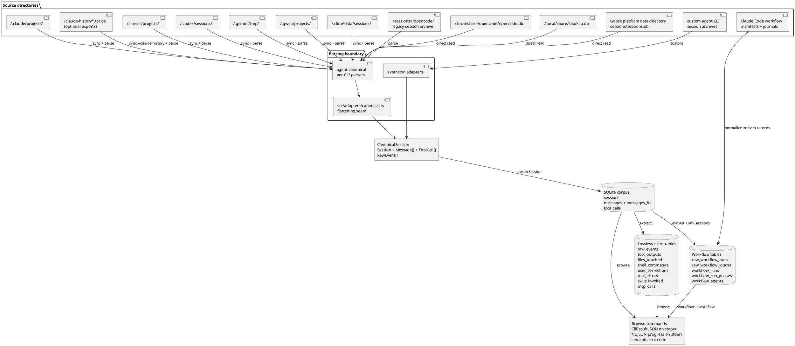

# Agentmine architecture

Reference for future-you (or another contributor) extending the tool. Focus on the contracts between
modules.

## Pipeline



Three layers, each with a stable contract:

1. **Parsers** read per-tool source data through `agent-canonical`; the flattening seam emits the
   Agentmine `CanonicalSession` shape. Extension adapters can emit that shape directly.
2. **DB writer** upserts canonical shape into the core and lossless tables idempotently.
3. **Extractors** read tool_calls and messages, write fact tables.

Claude Code workflow manifests and journals take a parallel supra-session path. `normalize` stores
them losslessly in `raw_workflow_runs` and `raw_workflow_journal`; `extract` derives run, phase,
and agent rollups and links them to canonical sessions when identifiers match.

Browse commands read from core + fact tables, always through prepared statements under a read-only
DB handle.

## Contracts

### Canonical shape — [src/adapters/types.ts](src/adapters/types.ts)

One Zod schema is the single source of truth for every adapter's output:

```ts
Session { id, source, externalId?, url?, parentSessionId?, agentType?,
          projectPath?, gitBranch?, model?, title?, author?, status?,
          startedAt?, endedAt?,
          messages: Message[], rawEvents?, messageParts?,
          contentHash, rawPath? }

Message { turn, role, author?, ts?, text, toolCalls }
  role ∈ "user" | "assistant" | "thinking" | "system" | "subagent"

ToolCall { name, args?, argsHash, argsPreview,
           outputPreview?, outputBytes?, outputSha?,
           exitCode?, durationMs?, callId?, outputFull? }

RawEvent { seq, eventType?, ts?, rawJson }

MessagePart { sourceSeq, partIdx, turn?, role, partType,
              text?, toolName?, toolCallIdx?, payloadJson,
              includedInMessageText }
```

`outputPreview` stays bounded for browsing while `outputFull` is persisted to `tool_outputs` for
complete analysis. `rawEvents` are stored in `raw_events` so adapter improvements can be audited
against source data. `messageParts` preserve ordered source content parts that may be more
structured than the normalized `messages` text, or intentionally excluded from it (for example
Cursor wrapper blocks and image parts).

### CLI envelope — [src/contract/result.ts](src/contract/result.ts)

Every command wraps its work in `runCommand({ command, handler })`. The handler returns
`{ data, warnings?, pagination?, meta?, status?, errors? }`. `runCommand` prints one JSON envelope
to stdout and exits with the right code. Never call `process.exit` directly in commands; throw a
`CliError` instead.

### Errors — [src/contract/errors.ts](src/contract/errors.ts)

Factory helpers produce `CliError` instances with the right code range and category. Map:

| Range | Category | Exit code |
|---|---|---|
| 1xxx | user | 2 |
| 2xxx | system | 3 |
| 3xxx | transient | 4 |

If you catch an unknown error that shouldn't crash the process, wrap it with
`wrapUnknown(err, contextMessage)`.

### Progress — [src/contract/progress.ts](src/contract/progress.ts)

```ts
reportProgress("phase.sub", { current: 50, total: 100, processed: 42 });
reportProgressImmediate("phase.start");   // bypasses throttle
```

Throttled to 10 Hz to avoid log spam. Events go to stderr; stdout stays data-only.

## Database lifecycle

- `openDb({ readonly?, init?, path? })` — returns a [src/db/sqlite.ts](src/db/sqlite.ts) handle, a
  thin compatibility shim over Node's built-in `node:sqlite` (`DatabaseSync`). It reproduces the
  small better-sqlite3-style API the codebase uses (`prepare<P, R>` / `pragma` / `transaction` /
  `execBatch` / `backup`), so there is no native dependency. In non-readonly mode it applies the
  bundled schema (idempotent `CREATE TABLE IF NOT EXISTS`) and writes `meta.schema_version`.
- Schema changes: edit [src/db/schema.sql](src/db/schema.sql) AND paste into
  [src/db/schemaText.ts](src/db/schemaText.ts) (the bundled binary doesn't ship the `.sql` file).
  Bump `SCHEMA_VERSION` in [src/db/client.ts](src/db/client.ts) if the change is breaking.
- Batch multi-statement SQL uses `runMultiStatementSql(db, sql)`, which calls the shim's
  `execBatch` compatibility method instead of reaching into `DatabaseSync` from callers.
- `upsertSession` is the only writer for normalized session data. It replaces each session's
  `messages`, `tool_calls`, `raw_events`, and `tool_outputs` in one transaction.
- `upsertWorkflowRunRaw` stores one workflow manifest and its journal rows idempotently; the
  workflow extractor rebuilds the derived workflow tables.

## Library export — [src/lib.ts](src/lib.ts)

`dist/lib.js` re-exports adapter functions and utilities for use by extension configs at
`~/.config/agentmine/extensions.js`:

| Export | Purpose |
|---|---|
| `parseClaudeCodeFile(path, opts?)` | Claude Code JSONL → `CanonicalSession`. Accepts `{ source?, idPrefix? }` to override defaults (`"claude-code"` / `"cc"`). |
| `parseCursorFile(path, opts?)` | Cursor JSONL → `CanonicalSession`. Supports top-level sessions and `subagents/` child sessions. |
| `walkJsonl(dir)` | Recursively find all `.jsonl` files under `dir`. |

This is a JavaScript runtime helper, not a typed package API; declarations are not published.

Custom agent-CLI imports can create an adapter that calls `parseClaudeCodeFile` with a custom
`source` and `idPrefix`, reusing the full Claude Code parser without duplication.

## Adapter contract

Each adapter exports an `async` parser that takes a source path and returns a
`CanonicalSession | null`. `null` means "no semantic content" (aborted sessions, pure-noise files).
Exceptions bubble up and are counted as `failed` in the normalize report.

Claude Code specific:
- Drops line types: `progress`, `file-history-snapshot`, `queue-operation`, `permission-mode`,
  `attachment`, `last-prompt`, `system`.
- Drops user messages wrapped in `<local-command-*>`, `<command-*>`, `<bash-input>`,
  `<bash-stdout>`, `<bash-stderr>`, `<persisted-output>`, `<system-reminder>`,
  `<task-notification>`, `<retrieval>`.
- Pairs `tool_use` with subsequent `tool_result` by `toolUseID` within the same session.
- Preserves raw JSONL events in `raw_events` and full tool results in `tool_outputs`.
- Accepts `AdapterOptions.source` and `AdapterOptions.idPrefix` to override the default
  `"claude-code"` / `"cc"` values for custom agent-CLI session imports.
- Subagent `.jsonl` files under `subagents/` are ingested by the recursive directory walker.
  When a transcript exposes `parentUuid`, the shared parser links it through `parentSessionId`.

Codex specific:

- `session_meta` distinguishes user roots, delegated workers, nested workers, and automatic
  Guardian reviews. Reliable direct parents become `parentSessionId` with the `cx--` prefix.
- Role-based v1 workers use `agent_role`; path-named v2 workers use `agent_path`; Guardian reviews
  use `guardian`. Root client originators such as `codex-tui` are not agent types.
- `spawn_agent` joins the shared `Task` / `Agent` / `Subagent` invocation facts. Exact child ids or
  stable task paths win; chronological matching is a deterministic fallback and never consumes a
  Guardian review as a delegated worker.

Cursor specific:
- One `.jsonl` transcript file maps to one session. Files under a `subagents/`
  directory link to their parent by directory placement.
- `startedAt` comes from Cursor's injected `<timestamp>` user-message tag when
  present, then falls back to the raw JSONL file mtime.
- Cursor transcripts do not provide reliable per-session model or token usage
  metadata; leave `model` and usage fields unset rather than storing estimates.
- Cursor does not store `tool_result` parts in these transcripts, so tool output,
  output bytes, durations, and exit codes remain unavailable.

Gemini CLI specific:

- `sync` mirrors `~/.gemini/tmp/` into `<sessions>/gemini/`; the recursive walker reads top-level
  chats and nested subagent JSONL files.
- Gemini message records expose model, per-message token usage, thinking, and enriched tool-call
  results. Thinking-only records retain their model and usage on the canonical thinking message.
- Same-id message revisions, `$set.messages` checkpoints, and rewinds are reconstructed before
  messages and usage totals are materialized. The store has no reliable live terminal marker, so
  the canonical Gemini entry intentionally exposes full-store parsing only.

Qwen Code specific:

- `sync` mirrors `~/.qwen/projects/` into `<sessions>/qwen/`; the recursive walker reads each
  `<cwd-slug>/chats/<sessionId>.jsonl` file.
- Qwen records expose model, per-message token usage, thinking parts, and separate tool-result
  records correlated by call id.
- The store has no reliable live terminal marker, so the canonical Qwen entry exposes full-store
  parsing only.

Cline specific:

- `sync` mirrors Cline's resolved sessions directory into `<sessions>/cline/`. Resolution follows
  Cline's own `CLINE_SESSION_DATA_DIR` → `CLINE_DATA_DIR/sessions` →
  `CLINE_DIR/data/sessions` → `~/.cline/data/sessions` precedence.
- A root session keeps `<id>.messages.json` and optional `<id>.json` metadata together. Subagent and
  team message artifacts may be additional `*.messages.json` siblings in the same directory; the
  walker ingests every nonempty sibling.
- The shared parser preserves thinking, per-message token usage, and tool results correlated across
  later messages by tool-use ID. `normalize --source cline` reads the mirrored file pairs.

Kilo Code specific:

- Kilo Code uses an opencode-lineage SQLite schema in `~/.local/share/kilo/kilo.db`.
- `normalize --source kilo` opens the live database read-only and stamps the canonical source as
  `kilo`; a source-specific import uses `normalize` plus `extract`, not `sync`.

Goose specific:

- Goose keeps all sessions in `sessions/sessions.db` below its data directory. Agentmine checks the
  current XDG location on Unix and macOS, then the legacy/documented macOS Application Support
  location, and uses the Windows AppData location. A non-empty `GOOSE_PATH_ROOT` takes precedence
  and resolves to `<root>/data/sessions/sessions.db`.
- `normalize --source goose` opens the live database read-only. The shared parser correlates tool
  requests and responses across later rows by call ID and stamps the canonical source as `goose`.
- Like Kilo Code, a source-specific Goose import uses `normalize` plus `extract`, not `sync`.

An unfiltered `agentmine ingest` mirrors Cline alongside the other file-backed sources and still
includes available opencode, Kilo Code, and Goose databases during its unfiltered `normalize`
stage.

When adding an adapter, add the parser to the `agent-canonical` package and expose a flatten
wrapper in [src/adapters/canonical.ts](src/adapters/canonical.ts); `normalize.ts` dispatches to
adapters by source.

### SQLite-backed stores are read live, not snapshotted

`agentmine sync` rsyncs Claude Code, Cursor, Codex, Gemini CLI, Qwen Code, and Cline
(file-per-session), but **deliberately does not snapshot the opencode, Kilo Code, or Goose SQLite
stores**. The `opencode-db`, `kilo`, and `goose` sources open their default databases directly in
read-only mode
via the `node:sqlite` shim (`readonly: true, fileMustExist: true`) and pass the handles to their
`agent-canonical` parsers. The reasons:

- These databases can be large and use WAL mode; copying them on every sync would dominate runtime
  for almost no benefit on most days.
- WAL gives us a consistent read snapshot without blocking the source CLI's writers, so reading
  live is safe.
- `sessions.db` is the persistent artifact Agentmine cares about; the
  raw session archive is incidental and recoverable from the source CLI itself.

The built-in sources always read the resolved standard opencode, Kilo Code, and Goose DB paths;
Goose's own `GOOSE_PATH_ROOT` environment override is supported, but there is no Agentmine CLI
override for an alternate copy. For a reproducible analysis, preserve the source DB separately or
provide a custom extension adapter. The file-based CLI stores remain rsync-based because their
per-session JSONL files are cheap and natural to mirror.

## Extractor contract

Each extractor in [src/extract/](src/extract/) is a pure function `(db) => count`. Must be
idempotent: `DELETE FROM <table>` first, then insert in a transaction. The orchestrator
[src/extract/index.ts](src/extract/index.ts) calls them in order (shell before corrections, because
corrections reads `shell_commands` to detect `followed_by_revert`).

Adding an extractor:

1. New file `src/extract/<name>.ts` exporting `extract<Thing>(db): number`.
2. Register in [src/extract/index.ts](src/extract/index.ts) and add a key to `ExtractorResult`.
3. If it writes a new table, add it to both schema files (see above).
4. Add a unit test in [tests/extract.test.ts](tests/extract.test.ts) that seeds a synthetic session
   and asserts row counts and columns.

## Browse-command contract

Each command in [src/commands/](src/commands/) is a citty `defineCommand(...)` wrapped in
`runCommand(...)`. Rules:

- Readonly commands (`stats`, `top`, `query`, `fts`, `similar`, `session`, `workflows`, `workflow`,
  `schema`) open DB with `{ readonly: true }`.
- Return `data` as `Record<string, unknown>` if multiple branches produce different shapes; type as
  `CommandOutcome<Data>` to keep the compiler happy.
- Never call `process.exit`; throw `Errors.<factory>(...)`.
- Put progress on stderr, never stdout.
- Commands emit one agent-friendly JSON envelope on stdout; they do not require a `--json` flag.
- Register in [src/main.ts](src/main.ts) `subCommands`; [src/cli.ts](src/cli.ts) stays a minimal
  warning-filter bootstrap.

## Correction classifier

Location: [src/extract/corrections.ts](src/extract/corrections.ts).

The ordered-regex classifier runs on every user turn after the first. First match wins. Confidence
is hard-coded per rule (0.5-0.9). Kind semantics are documented alongside the rules in that file.
Notes:

- Cyrillic strings (e.g. "по-русски") need Unicode-aware boundaries. The `STYLE` regex uses
  `(?:^|[^\p{L}])(...)(?=[^\p{L}]|$)` with the `/u` flag. JavaScript `\b` is ASCII-only.
- `followed_by_revert` scans the next 10 turns' `shell_commands` for `git revert` / `git restore` /
  `git reset --hard`. Extractors that populate `shell_commands` must run before `corrections.ts` —
  enforced by the orchestrator's call order.
- The correction classifier is deterministic and regex-based.

## Testing strategy

| Test file | Coverage |
|---|---|
| [tests/smoke.test.ts](tests/smoke.test.ts) | CLI envelope shape, exit codes, and stdout cleanliness from source via `tsx` + `execa`. |
| [tests/distSmoke.test.ts](tests/distSmoke.test.ts) | Packed CLI/library loading, file allowlist, Markdown links, warning behavior, and executable mode. CI also runs it on exact Node 24.0.0. |
| [tests/canonicalSeam.test.ts](tests/canonicalSeam.test.ts) | Canonical seam smoke: Claude Code, Gemini, Qwen, and Cline fixtures flow through shared `agent-canonical` parsers into the flat `CanonicalSession` shape. |
| [tests/extract.test.ts](tests/extract.test.ts) | Corrections classifier for all 7 kinds. Each fact extractor on synthetic sessions: files_touched, shell_commands (wrapper stripping), tool_errors (category inference), user_corrections (preceding_turn + response_time + followed_by_revert). |
| [tests/workflowRuns.test.ts](tests/workflowRuns.test.ts) | Lossless workflow manifest/journal ingest, derived run/phase/agent rows, session linkage, and idempotence. |

When you add a feature, prefer synthetic-session fixtures over real-data snapshots (reproducible, no
PII, fast).

## Known gotchas

- **Multi-statement SQL** — keep batch execution behind the `execBatch` compatibility method and
  call it through `runMultiStatementSql` rather than reaching into `DatabaseSync` directly.
- **Node 25's `--experimental-strip-types`** — doesn't rewrite `.js` imports to `.ts`. Use `tsx` for
  dev runs, or the compiled `dist/cli.js` for production use. Direct `node src/cli.ts` will fail.
- **FTS5 hyphen handling** — FTS5 parses `agent-first` as `agent MINUS first`. Wrap in double
  quotes: `agentmine fts '"agent-first"'`.
- **No native dependencies** — storage is Node's built-in `node:sqlite` (requires Node >= 24), so
  there is nothing to compile for the DB driver. Only esbuild (via tsup) needs dependency-build
  approval, declared in the standalone repository's root pnpm configuration.
- **`node:sqlite` under Vitest needs Vitest ≥ 3 (Vite ≥ 7)** — Vitest 2.x's vite-node runner strips
  the `node:` prefix and then can't resolve bare `sqlite` (it is in `module.builtinModules` only as
  `node:sqlite`, and Vite 5 builds its builtin set from non-prefixed names), so every suite that
  imports the DB layer fails to load with `Failed to load url sqlite`. Vitest 3's module runner
  resolves `node:` builtins correctly; agentmine pins `vitest ^3`.
- **tsup `removeNodeProtocol` defaults true → broken published CLI** — it rewrites the bundled
  `import … from "node:sqlite"` to bare `sqlite`, so the installed CLI crashes at load with
  `Cannot find package 'sqlite'`. `tsup.config.ts` sets `removeNodeProtocol: false`. The trap is
  invisible to the test suite: every other test runs the CLI from `src/` via `tsx`, never the
  bundle. `tests/distSmoke.test.ts` builds and runs `dist/cli.js` to catch this class — when adding
  any new `node:` builtin import, keep that guard green.
- **Early Node 24 emits the SQLite warning before static entry imports finish** — keep `src/cli.ts`
  as the warning-filter bootstrap and load the command graph dynamically from `src/main.ts`.
