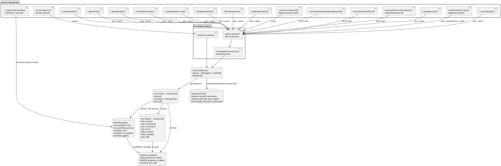

# Agentmine architecture

Reference for future-you (or another contributor) extending the tool. Focus on the contracts between
modules.

## Pipeline


```plantuml
@startuml
skinparam monochrome true
skinparam shadowing false

folder "Source directories" {
  [~/.claude/projects/] as claude
  [~/claude-history*.tar.gz\n(optional exports)] as claudeHistory
  [~/.cursor/projects/] as cursor
  [~/.codex/sessions/] as codex
  [~/.gemini/tmp/] as gemini
  [~/.qwen/projects/] as qwen
  [~/.cline/data/sessions/] as cline
  [~/.copilot/session-state/] as copilot
  [~/.pi/agent/sessions/] as pi
  [~/.factory/sessions/] as droid
  [~/.vibe/logs/session/] as vibe
  [<sessions>/opencode/\nlegacy session archive] as opencodeFiles
  [~/.local/share/opencode/opencode.db] as opencodeDb
  [~/.local/share/kilo/kilo.db] as kiloDb
  [Goose platform data directory\nsessions/sessions.db] as gooseDb
  [Claude Code workflow\nmanifests + journals] as workflowSource
  [custom agent CLI\nsession archives] as external
}

package "Parsing boundary" {
  [agent-canonical\nper-CLI parsers] as sharedParsers
  [src/adapters/canonical.ts\nflattening seam] as flatteningSeam
  [extension adapters] as extensionAdapters
}

rectangle "CanonicalSession\nSession + Message[] + ToolCall[]\nRawEvent[]" as canonical
database "Hot corpus — sessions.db\nsessions\nmessages + messages_fts\ntool_calls" as core
database "Fact tables — sessions.db\nfiles_touched\nshell_commands\nuser_corrections\ntool_errors\nskills_invoked\nskills_available\nmcp_calls\n..." as facts
database "Payload archives\nsessions-raw.db: raw_events\nsessions-tools.db: tool_outputs\n(zstd BLOBs, attached on demand)" as archives
database "Workflow tables\nraw_workflow_runs\nraw_workflow_journal\nworkflow_runs\nworkflow_run_phases\nworkflow_agents" as workflows
rectangle "Browse commands\nCliResult JSON on stdout\nNDJSON progress on stderr\nsemantic exit code" as cli

claude --> sharedParsers : sync + parse
claudeHistory --> sharedParsers : sync --claude-history + parse
cursor --> sharedParsers : sync + parse
codex --> sharedParsers : sync + parse
gemini --> sharedParsers : sync + parse
qwen --> sharedParsers : sync + parse
cline --> sharedParsers : sync + parse
copilot --> sharedParsers : sync + parse
pi --> sharedParsers : sync + parse
droid --> sharedParsers : sync + parse
vibe --> sharedParsers : sync + parse
opencodeFiles --> sharedParsers : parse
opencodeDb --> sharedParsers : direct read
kiloDb --> sharedParsers : direct read
gooseDb --> sharedParsers : direct read
workflowSource --> workflows : normalize lossless records
external --> extensionAdapters : custom

sharedParsers --> flatteningSeam
flatteningSeam --> canonical
extensionAdapters --> canonical

canonical --> archives : writeSessionPayload (commits first)
canonical --> core : upsertSession
core --> facts : extract
core --> workflows : extract + link sessions
core --> cli : browse
facts --> cli : browse
workflows --> cli : workflows / workflow
@enduml
```

Three layers, each with a stable contract:

1. **Parsers** read per-tool source data through `agent-canonical`; the flattening seam emits the
   Agentmine `CanonicalSession` shape. Extension adapters can emit that shape directly.
2. **DB writer** upserts canonical shape idempotently — cold payload into the archives first, then
   the hot rows that reference it, preserving the cold-first ordering invariant.
3. **Extractors** read tool_calls and messages, write fact tables.

Claude Code workflow manifests and journals take a parallel supra-session path. `normalize` stores
them losslessly in `raw_workflow_runs` and `raw_workflow_journal`; `extract` derives run, phase,
and agent rollups and links them to canonical sessions when identifiers match.

Browse commands read from core + fact tables, always through prepared statements under a read-only
DB handle.

## Contracts

### Canonical shape — [src/adapters/types.ts](src/adapters/types.ts)

One Zod schema is the single source of truth for every adapter's output:

```ts
Session { id, source, externalId?, url?, parentSessionId?, agentType?,
          projectPath?, gitBranch?, model?, title?, author?, status?,
          startedAt?, endedAt?,
          messages: Message[], rawEvents?, messageParts?,
          contentHash, rawPath? }

Message { turn, role, author?, ts?, text, toolCalls }
  role ∈ "user" | "assistant" | "thinking" | "system" | "subagent"

ToolCall { name, args?, argsHash, argsPreview,
           outputPreview?, outputBytes?, outputSha?,
           exitCode?, durationMs?, callId?, outputFull? }

RawEvent { seq, eventType?, ts?, rawJson }

MessagePart { sourceSeq, partIdx, turn?, role, partType,
              text?, toolName?, toolCallIdx?, payloadJson,
              includedInMessageText }
```

`outputPreview` stays bounded for browsing while `outputFull` is persisted for complete analysis.
`rawEvents` are retained so adapter improvements can be audited against source data. Both are cold
payload and live in sibling archive databases rather than `sessions.db` — see
[Storage layout](#storage-layout--sibling-payload-archives). `messageParts` preserve ordered source content parts that may be more
structured than the normalized `messages` text, or intentionally excluded from it (for example
Cursor wrapper blocks and image parts).

### CLI envelope — [src/contract/result.ts](src/contract/result.ts)

Every command wraps its work in `runCommand({ command, handler })`. The handler returns
`{ data, warnings?, pagination?, meta?, status?, errors? }`. `runCommand` prints one JSON envelope
to stdout and exits with the right code. Never call `process.exit` directly in commands; throw a
`CliError` instead.

### Errors — [src/contract/errors.ts](src/contract/errors.ts)

Factory helpers produce `CliError` instances with the right code range and category. Map:

| Range | Category | Exit code |
|---|---|---|
| 1xxx | user | 2 |
| 2xxx | system | 3 |
| 3xxx | transient | 4 |

If you catch an unknown error that shouldn't crash the process, wrap it with
`wrapUnknown(err, contextMessage)`.

### Progress — [src/contract/progress.ts](src/contract/progress.ts)

```ts
reportProgress("phase.sub", { current: 50, total: 100, processed: 42 });
reportProgressImmediate("phase.start");   // bypasses throttle
```

Throttled to 10 Hz to avoid log spam. Events go to stderr; stdout stays data-only.

## Storage layout — sibling payload archives

A corpus is **three SQLite files**, not one:

| file | holds |
|---|---|
| `sessions.db` | everything queries read: sessions, messages, tool-call metadata + previews, all fact and pattern tables, FTS, every index |
| `sessions-raw.db` | `raw_events` — verbatim source events |
| `sessions-tools.db` | `tool_outputs` — full untruncated tool output |

Verbatim payload was ~75% of corpus bytes while no interactive command read it, and its index pages
interleaved with hot rows across the whole file, so cold reads paid for data they never used.
Archived payload is stored zstd-3 compressed as BLOBs with a one-byte encoding frame
([src/db/payloadCodec.ts](src/db/payloadCodec.ts)) and reached through
[src/db/archives.ts](src/db/archives.ts).

Consequences that constrain new code:

- **Attach on demand, never by default.** A command that needs payload calls `attachArchive`; one
  that does not must never attach, so its cost stays bounded by the hot database. `stats` reads
  payload totals from the `sessions.raw_event_count` / `tool_output_count` counters.
- **Payload is not SQL-searchable.** It is compressed binary, so `LIKE` and `json_extract` cannot
  reach it. Derive what you need at normalize time from parsed events instead of scanning payload
  later — this is why skill listings moved into the writer.
- **Cross-database transactions are NOT atomic under WAL.** Ordering substitutes for atomicity:
  `writeSessionPayload` commits before `upsertSession`; deletes go hot-first. An interruption may
  orphan archive rows (valid, self-healing) but must never leave a hot row without its payload.
  Single-session callers use `upsertSessionWithPayload`, which orders both phases.
- `agentmine compact` migrates a pre-0.9 corpus and is resumable. The common database-open gate
  refuses every normal corpus command until it has run; `backup` and `compact` are the recovery
  exceptions. `agentmine backup` holds the corpus writer lock while snapshotting the hot database
  and every existing payload archive, so its tarball is a complete corpus backup.

## Database lifecycle

- `openDb({ readonly?, init?, path?, allowPreSplit? })` — returns a
  [src/db/sqlite.ts](src/db/sqlite.ts) handle, a
  compatibility shim over Node's built-in `node:sqlite` (`DatabaseSync`) in the npm distribution
  and Bun's built-in `bun:sqlite` (`Database`) in standalone executables. It reproduces the small
  better-sqlite3-style API the codebase uses (`prepare<P, R>` / `pragma` / `transaction` /
  `execBatch` / `backup`), so there is no third-party native dependency. Node uses its online
  backup API; Bun uses `VACUUM INTO` so WAL-mode backups remain self-contained. In non-readonly
  mode the wrapper applies the bundled schema (idempotent `CREATE TABLE IF NOT EXISTS`) and writes
  `meta.schema_version`.
- Schema changes: edit [src/db/schema.sql](src/db/schema.sql) AND paste into
  [src/db/schemaText.ts](src/db/schemaText.ts) (the bundled binary doesn't ship the `.sql` file).
  Bump `SCHEMA_VERSION` in [src/db/client.ts](src/db/client.ts) if the change is breaking.
- Batch multi-statement SQL uses `runMultiStatementSql(db, sql)`, which calls the shim's
  `execBatch` compatibility method instead of reaching into `DatabaseSync` from callers.
- `upsertSession` is the only writer for normalized session data. It replaces each session's
  `messages` and `tool_calls` in one transaction. Cold payload is written separately and
  **earlier** by `writeSessionPayload`; see [Storage layout](#storage-layout--sibling-payload-archives).
- `dirty_sessions` plus the raw-workflow pending marker form the authoritative
  normalized-to-derived freshness boundary. Successful normalize and extract runs record stage
  timestamps in `meta`; `src/db/freshness.ts` combines those timestamps with both pending signals
  for `stats` and fact-reading command warnings.
- `upsertWorkflowRunRaw` stores one workflow manifest and its journal rows idempotently; the
  workflow extractor rebuilds the derived workflow tables.

## Library export — [src/lib.ts](src/lib.ts)

`dist/lib.js` re-exports adapter functions and utilities for use by extension configs at
`~/.config/agentmine/extensions.js`:

| Export | Purpose |
|---|---|
| `parseClaudeCodeFile(path, opts?)` | Claude Code JSONL → `CanonicalSession`. Accepts `{ source?, idPrefix? }` to override defaults (`"claude-code"` / `"cc"`). |
| `parseCursorFile(path, opts?)` | Cursor JSONL → `CanonicalSession`. Supports top-level sessions and `subagents/` child sessions. |
| `walkJsonl(dir)` | Recursively find all `.jsonl` files under `dir`. |

This is a JavaScript runtime helper, not a typed package API; declarations are not published.

Custom agent-CLI imports can create an adapter that calls `parseClaudeCodeFile` with a custom
`source` and `idPrefix`, reusing the full Claude Code parser without duplication.

## Adapter contract

Each adapter exports an `async` parser that takes a source path and returns a
`CanonicalSession | null`. `null` means "no semantic content" (aborted sessions, pure-noise files).
Exceptions bubble up and are counted as `failed` in the normalize report.

Claude Code specific:
- Drops line types: `progress`, `file-history-snapshot`, `queue-operation`, `permission-mode`,
  `attachment`, `last-prompt`, `system`.
- Drops user messages wrapped in `<local-command-*>`, `<command-*>`, `<bash-input>`,
  `<bash-stdout>`, `<bash-stderr>`, `<persisted-output>`, `<system-reminder>`,
  `<task-notification>`, `<retrieval>`.
- Pairs `tool_use` with subsequent `tool_result` by `toolUseID` within the same session.
- Preserves raw JSONL events and full tool results; both are archived as cold payload.
- Accepts `AdapterOptions.source` and `AdapterOptions.idPrefix` to override the default
  `"claude-code"` / `"cc"` values for custom agent-CLI session imports.
- Subagent `.jsonl` files under `subagents/` are ingested by the recursive directory walker.
  When a transcript exposes `parentUuid`, the shared parser links it through `parentSessionId`.

Codex specific:

- `session_meta` distinguishes user roots, delegated workers, nested workers, and automatic
  Guardian reviews. Reliable direct parents become `parentSessionId` with the `cx--` prefix.
- Role-based v1 workers use `agent_role`; path-named v2 workers use `agent_path`; Guardian reviews
  use `guardian`. Root client originators such as `codex-tui` are not agent types.
- `spawn_agent` joins the shared `Task` / `Agent` / `Subagent` invocation facts. Exact child ids or
  stable task paths win; chronological matching is a deterministic fallback and never consumes a
  Guardian review as a delegated worker.

Cursor specific:
- One `.jsonl` transcript file maps to one session. Files under a `subagents/`
  directory link to their parent by directory placement.
- `startedAt` comes from Cursor's injected `<timestamp>` user-message tag when
  present, then falls back to the raw JSONL file mtime.
- Cursor transcripts do not provide reliable per-session model or token usage
  metadata; leave `model` and usage fields unset rather than storing estimates.
- Cursor does not store `tool_result` parts in these transcripts, so tool output,
  output bytes, durations, and exit codes remain unavailable.

Gemini CLI specific:

- `sync` mirrors `~/.gemini/tmp/` into `<sessions>/gemini/`; the recursive walker reads top-level
  chats and nested subagent JSONL files.
- Gemini message records expose model, per-message token usage, thinking, and enriched tool-call
  results. Thinking-only records retain their model and usage on the canonical thinking message.
- Same-id message revisions, `$set.messages` checkpoints, and rewinds are reconstructed before
  messages and usage totals are materialized. The store has no reliable live terminal marker, so
  the canonical Gemini entry intentionally exposes full-store parsing only.

Qwen Code specific:

- `sync` mirrors `~/.qwen/projects/` into `<sessions>/qwen/`; the recursive walker reads each
  `<cwd-slug>/chats/<sessionId>.jsonl` file.
- Qwen records expose model, per-message token usage, thinking parts, and separate tool-result
  records correlated by call id.
- The store has no reliable live terminal marker, so the canonical Qwen entry exposes full-store
  parsing only.

Cline specific:

- `sync` mirrors Cline's resolved sessions directory into `<sessions>/cline/`. Resolution follows
  Cline's own `CLINE_SESSION_DATA_DIR` → `CLINE_DATA_DIR/sessions` →
  `CLINE_DIR/data/sessions` → `~/.cline/data/sessions` precedence.
- A root session keeps `<id>.messages.json` and optional `<id>.json` metadata together. Subagent and
  team message artifacts may be additional `*.messages.json` siblings in the same directory; the
  walker ingests every nonempty sibling.
- The shared parser preserves thinking, per-message token usage, and tool results correlated across
  later messages by tool-use ID. `normalize --source cline` reads the mirrored file pairs.

GitHub Copilot CLI specific:

- `sync` mirrors `~/.copilot/session-state/` into `<sessions>/copilot/`. Each session is a directory
  whose `events.jsonl` (a typed event stream, one `{type, data, id, timestamp, parentId}` per line)
  is the lossless source of truth; the sibling per-session `session.db` and the top-level
  `session-store.db` FTS index are not read.
- The shared parser folds the event stream into canonical messages, correlating each tool call
  (issued in an `assistant.message`) with its later `tool.execution_complete` by `toolCallId`, and
  splits `reasoningText` into thinking. Per-message usage is output-only, so transcript totals come
  from the `session.shutdown` aggregate. `normalize --source copilot` reads the mirrored
  `events.jsonl` files.

Pi specific:

- `sync` mirrors `~/.pi/agent/sessions/` into `<sessions>/pi/`. Each session is one append-only
  JSONL file, nested a single cwd-slug directory down; `--continue` reopens the same file instead
  of starting a new one, so a session's whole history — including in-place branches — lives there.
- The shared parser walks the entry DAG in file order, splits thinking blocks into their own
  messages, correlates each tool call with its later `toolResult` by `toolCallId`, and sums
  per-message usage. `normalize --source pi` reads the mirrored JSONL files.

Factory Droid specific:

- `sync` mirrors `~/.factory/sessions/` into `<sessions>/droid/`. Each session is a `<id>.jsonl`
  conversation plus a `<id>.settings.json` sibling; a byte-identical `.settings.json.bak` sits
  beside it. Only the JSONL is walked — the parser discovers the settings file itself.
- The settings sibling is the only source of the model alias and the session token totals, so it is
  a freshness sibling and joins the ingest cache key; a settings-only rewrite still refreshes the
  row. `normalize --source droid` reads the mirrored JSONL files.

Mistral Vibe specific:

- `sync` mirrors `~/.vibe/logs/session/` into `<sessions>/vibe/`. Each session is a directory
  holding `messages.jsonl` (one raw chat-completions message per line) and a `meta.json` sidecar;
  the `.last_session` pointer directory holds no session content and is skipped.
- `meta.json` is the only source of identity, timing, project path, git branch, model, and token
  totals, so it is a freshness sibling and joins the ingest cache key. `normalize --source vibe`
  reads the mirrored `messages.jsonl` files.

Kilo Code specific:

- Kilo Code uses an OpenCode-lineage SQLite schema in `~/.local/share/kilo/kilo.db`.
- `normalize --source kilo` opens the live database read-only and stamps the canonical source as
  `kilo`; a source-specific import uses `normalize` plus `extract`, not `sync`.

Goose specific:

- Goose keeps all sessions in `sessions/sessions.db` below its data directory. Agentmine checks the
  current XDG location on Unix and macOS, then the legacy/documented macOS Application Support
  location, and uses the Windows AppData location. A non-empty `GOOSE_PATH_ROOT` takes precedence
  and resolves to `<root>/data/sessions/sessions.db`.
- `normalize --source goose` opens the live database read-only. The shared parser correlates tool
  requests and responses across later rows by call ID and stamps the canonical source as `goose`.
- Like Kilo Code, a source-specific Goose import uses `normalize` plus `extract`, not `sync`.

An unfiltered `agentmine ingest` mirrors Cline alongside the other file-backed sources and still
includes available OpenCode, Kilo Code, and Goose databases during its unfiltered `normalize`
stage.

When adding an adapter, add the parser to the `agent-canonical` package and expose a flatten
wrapper in [src/adapters/canonical.ts](src/adapters/canonical.ts); `normalize.ts` dispatches to
adapters by source.

### SQLite-backed stores are read live, not snapshotted

`agentmine sync` rsyncs Claude Code, Cursor, Codex, Gemini CLI, Qwen Code, Cline, and GitHub
Copilot CLI (file-per-session), but **deliberately does not snapshot the OpenCode, Kilo Code, or
Goose SQLite stores**. The `opencode-db`, `kilo`, and `goose` sources open their default
databases directly in read-only mode
via the runtime-native SQLite shim (`readonly: true, fileMustExist: true`) and pass the handles to
their `agent-canonical` parsers. The reasons:

- These databases can be large and use WAL mode; copying them on every sync would dominate runtime
  for almost no benefit on most days.
- WAL gives us a consistent read snapshot without blocking the source CLI's writers, so reading
  live is safe.
- `sessions.db` is the persistent artifact Agentmine cares about; the
  raw session archive is incidental and recoverable from the source CLI itself.

The built-in sources always read the resolved standard OpenCode, Kilo Code, and Goose DB paths;
Goose's own `GOOSE_PATH_ROOT` environment override is supported, but there is no Agentmine CLI
override for an alternate copy. For a reproducible analysis, preserve the source DB separately or
provide a custom extension adapter. The file-based CLI stores remain rsync-based because their
per-session JSONL files are cheap and natural to mirror.

## Extractor contract

Each per-session extractor in [src/extract/](src/extract/) is an idempotent function
`(db, scope) => count`. The orchestrator [src/extract/index.ts](src/extract/index.ts) calls them in
order (shell before corrections, because corrections reads `shell_commands` to detect
`followed_by_revert`).

**Incremental scope.** `extract` runs over only the sessions a preceding `normalize` marked dirty
(`db/writer.ts` inserts into `dirty_sessions` on every upsert); the `extract` command clears the ids
it processed. `runAllExtractors(db, ids)` threads an `ExtractScope`
([src/extract/scope.ts](src/extract/scope.ts)) into each extractor: `scopedDelete(db, scope, table)`
deletes only the in-scope fact rows and `scopeAnd(scope)` / `scopeWhere(scope)` bound each source
read. A full rebuild (`ids === null`, or `extract --force`) passes the empty fragment and clears the
whole table, exactly as before. The corpus-aggregate extractors (subagents, ngrams, templates, and
the `subagent_count` rollup) ignore the scope and always rebuild — their output is a function of the
whole corpus and they are cheap once `idx_sessions_parent` exists.
`tests/incrementalExtract.test.ts` pins the invariant: a scoped rebuild of a changed session
equals a full rebuild.

Raw workflow manifests and journals have a separate durable pending marker because they can change
without a transcript changing. A workflow-only extract rebuilds just the workflow fact tables;
ordinary scoped and forced extracts also clear that marker after rebuilding them.

Adding an extractor:

1. New file `src/extract/<name>.ts` exporting `extract<Thing>(db, scope): number`. Swap the
   table-wide `DELETE` for `scopedDelete(...)` and append `scopeAnd`/`scopeWhere` to the source read
   (or leave it a corpus-aggregate that ignores `scope` and rebuilds fully — keep those cheap).
2. Register in [src/extract/index.ts](src/extract/index.ts) and add a key to `ExtractorResult`.
3. If it writes a new table, add it to both schema files (see above).
4. Add a unit test in [tests/extract.test.ts](tests/extract.test.ts) that seeds a synthetic session
   and asserts row counts and columns; extend `tests/incrementalExtract.test.ts` if the new table
   should survive the scoped-equals-full check.

## Browse-command contract

Each command in [src/commands/](src/commands/) is a citty `defineCommand(...)` wrapped in
`runCommand(...)`. Rules:

- Readonly commands (`stats`, `top`, `query`, `fts`, `similar`, `session`, `workflows`, `workflow`,
  `schema`) open DB with `{ readonly: true }`.
- Return `data` as `Record<string, unknown>` if multiple branches produce different shapes; type as
  `CommandOutcome<Data>` to keep the compiler happy.
- Never call `process.exit`; throw `Errors.<factory>(...)`.
- Put progress on stderr, never stdout.
- Commands emit one agent-friendly JSON envelope on stdout; they do not require a `--json` flag.
- Register in [src/main.ts](src/main.ts) `subCommands`; [src/cli.ts](src/cli.ts) stays a minimal
  warning-filter bootstrap.

## Correction classifier

Location: [src/extract/corrections.ts](src/extract/corrections.ts).

The ordered-regex classifier runs on every user turn after the first. First match wins. Confidence
is hard-coded per rule (0.5-0.9). Kind semantics are documented alongside the rules in that file.
Notes:

- Cyrillic strings (e.g. "по-русски") need Unicode-aware boundaries. The `STYLE` regex uses
  `(?:^|[^\p{L}])(...)(?=[^\p{L}]|$)` with the `/u` flag. JavaScript `\b` is ASCII-only.
- `followed_by_revert` scans the next 10 turns' `shell_commands` for `git revert` / `git restore` /
  `git reset --hard`. Extractors that populate `shell_commands` must run before `corrections.ts` —
  enforced by the orchestrator's call order.
- The correction classifier is deterministic and regex-based.

## Testing strategy

### Cold-import benchmark

From the Agentmine package root, `pnpm --silent benchmark:cold-import` runs the local-only
cold-normalize harness in `scripts/cold-import-benchmark.mjs`. `--silent` preserves its
one-JSON-line stdout contract. The harness requires a transcript archive path, an absolute work
directory outside every registered Git worktree, a fixed UTC cutoff, a lowercase variant ID, and
absolute paths to pinned Node and Bun Agentmine artifacts. The runtime invocation must reference
the matching declared artifact. For example:

```bash
pnpm --silent benchmark:cold-import \
  --variant baseline \
  --archive-root ~/claude-history-YYYYMMDD \
  --work-dir /var/tmp/agentmine-cold-import \
  --cutoff 2026-01-01T00:00:00Z \
  --node-command node \
  --node-arg /path/to/node-artifact/cli.js \
  --node-artifact /path/to/node-artifact \
  --bun-command /path/to/agentmine-bun \
  --bun-artifact /path/to/agentmine-bun
```

The defaults select exactly 1,000 unique root Claude Code session files near 512 MiB and measure
three serial ABBA blocks. Directory fingerprints hash sorted per-file SHA-256 output with relative
names; a standalone-file fingerprint hashes its raw bytes. The receipt also records file count and
total bytes. The harness verifies the active artifact before and after every run, and artifact trees
must not contain symlinks.

The harness creates a new database for every run, aborts below 8 GiB free or above 2 GiB for the
database plus WAL, validates SQLite and FTS integrity plus fixed query hashes, deletes the staged
fixture and databases, and retains one path-scrubbed local receipt. That receipt still contains
corpus-derived counts and non-reversible fingerprints, so treat it as sensitive and do not publish
it. Its compatibility fixture digest covers the selected JSONL bytes; a second tree digest binds
relative paths and supplemental metadata. It rehashes every staged file after the runs. Use
`--stage-mode copy` when the archive and work directory are on different filesystems or source
inode metadata must remain untouched. Hardlink creation and removal update source ctime without
changing contents. A lowered safety floor is recorded in the receipt; do not lower it for a result
intended to guide production changes. The first `SIGINT` or `SIGTERM` terminates the active process
group and waits for cleanup; a second signal hard-stops it.

| Test file | Coverage |
|---|---|
| [tests/coldImportBenchmark.test.ts](tests/coldImportBenchmark.test.ts) | Fixture selection and revalidation, fresh-session accounting, artifact pinning, ABBA scheduling, cutoff filtering, worktree containment, signal handling, GNU time parsing, coded errors, and path sanitization. |
| [tests/smoke.test.ts](tests/smoke.test.ts) | CLI envelope shape, exit codes, and stdout cleanliness from source via `tsx` + `execa`. |
| [tests/distSmoke.test.ts](tests/distSmoke.test.ts) | Packed CLI/library loading, file allowlist, Markdown links, warning behavior, and executable mode. CI also runs it on exact Node 24.0.0. |
| [tests/canonicalSeam.test.ts](tests/canonicalSeam.test.ts) | Canonical seam smoke: Claude Code, Gemini, Qwen, Cline, and Copilot fixtures flow through shared `agent-canonical` parsers into the flat `CanonicalSession` shape. |
| [tests/extract.test.ts](tests/extract.test.ts) | Corrections classifier for all 7 kinds. Each fact extractor on synthetic sessions: files_touched, shell_commands (wrapper stripping), tool_errors (category inference), user_corrections (preceding_turn + response_time + followed_by_revert). |
| [tests/workflowRuns.test.ts](tests/workflowRuns.test.ts) | Lossless workflow manifest/journal ingest, derived run/phase/agent rows, session linkage, and idempotence. |

When you add a feature, prefer synthetic-session fixtures over real-data snapshots (reproducible, no
PII, fast).

## Known gotchas

- **Multi-statement SQL** — keep batch execution behind the `execBatch` compatibility method and
  call it through `runMultiStatementSql` rather than reaching into `DatabaseSync` directly.
- **Node 25's `--experimental-strip-types`** — doesn't rewrite `.js` imports to `.ts`. Use `tsx` for
  dev runs, or the compiled `dist/cli.js` for production use. Direct `node src/cli.ts` will fail.
- **FTS5 hyphen handling** — FTS5 parses `agent-first` as `agent MINUS first`. Wrap in double
  quotes: `agentmine fts '"agent-first"'`.
- **No third-party native DB dependency** — the npm package uses Node's built-in `node:sqlite`
  (requires Node >= 24), while standalone executables use Bun's built-in `bun:sqlite`. Bun and
  esbuild are the only approved dependency install scripts in the standalone repository policy.
- **`node:sqlite` under Vitest needs Vitest ≥ 3 (Vite ≥ 7)** — Vitest 2.x's vite-node runner strips
  the `node:` prefix and then can't resolve bare `sqlite` (it is in `module.builtinModules` only as
  `node:sqlite`, and Vite 5 builds its builtin set from non-prefixed names), so every suite that
  imports the DB layer fails to load with `Failed to load url sqlite`. Vitest 3's module runner
  resolves `node:` builtins correctly; agentmine pins `vitest ^3`.
- **tsup `removeNodeProtocol` defaults true → broken published CLI** — it rewrites the bundled
  `import … from "node:sqlite"` to bare `sqlite`, so the installed CLI crashes at load with
  `Cannot find package 'sqlite'`. `tsup.config.ts` sets `removeNodeProtocol: false`. The trap is
  invisible to the test suite: every other test runs the CLI from `src/` via `tsx`, never the
  bundle. `tests/distSmoke.test.ts` builds and runs `dist/cli.js` to catch this class — when adding
  any new `node:` builtin import, keep that guard green.
- **Early Node 24 emits the SQLite warning before static entry imports finish** — keep `src/cli.ts`
  as the warning-filter bootstrap and load the command graph dynamically from `src/main.ts`.
